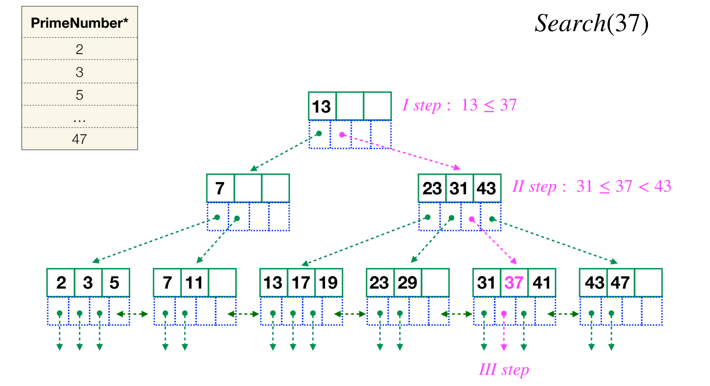

# YouTrack
## Интеграция с репозиторием

# Знать k8s на уровне Namespace/Deployment/Service/Pod
## Namespace
    Это область работы среды окружения
## Deployment
    - помогает:
        - разворачивать окружение
        - откатывать окружение при возникновении ошибки
        - обновление системы без простоя(стратегия RollingUpdate)
    - можно указать:
        - кол-во реплик
        - стратегию
## Service
    - даёт доступ к полам извне
    - занимается балансировкой между подами
## Pod
    - похож на контейнеры в докере, но в поде можно держать несколько контейнеров(в жизни не встречала такого)

# FulltextSearch
    Используется индекс GIN
    - Механизм похож на B-Tree, только в элементах индекса хранится не ссылка, а набор ссылок

# Индексы в postgreSQL
## B-tree
    - Это тип индекса по умолчанию в Postgres
    - Поиск быстрый, но остальные действия нет

## хэш
    - Идеальный пример это map в Golang
    - Бакеты
    - Коллизия
    - Допустимые типа ключа - срезы, мапы, функциии
## GIN
    - Используется для полнотекстового поиска
    - Механизм похож на B-Tree, только в элементах индекса хранится не ссылка, а набор ссылок
## GiST
    - Механизм как и у B-Tree, только B-Tree использует операторы больше/меньше/равно, 
      а для некоторых типов данных(например, геоданные) эти операторы бесполезны. Для этого есть индекс Gist

# Логирование в pgx
[gen_swag.go](internal%2Fhandler%2Fgen_swag.go)

# goroutine
    Goroutine это поток, запускаемый рантаймом
    Особенности:
    - Легковесный - запускаются в потоке самой программы, а не в ОС
    - Отсутствие лимитов на кол-во горутин
    - Конкурентность

## Общение между goroutine-ами
    - Каналы - буферизованные и не буферизованные
    - wait group из пакета sync нужен для завершения всех горутин до завершения основного
    - mutex (Mutex, RWMutex)

# Работать с композицией типов
    type HttpClient interface {
        Post()
        Get()
    }

    type Create struct {
        client HttpClient
    }

    func (c *Create) Post() { // some code }
    

    type Get struct {
        client HttpClient
    }

    func (g *Get) Get() {}

# ElasticSearch
## заполнять индекс elasticsearch на базе данных из Postgres
    Можно провести условную аналогию: индекс — это база данных, а тип — таблица в этой БД, документ - запись в таблице
[elastic.go](internal%2Felastic%2Felastic.go)
## Писать сложные запросы с настройкой релевантности
    - поле _score(по умолчанию сортируются по этому полю)
    - релевантность считается по алгоритму BM25 на основе следующего:
        - Как часто термин появляется в документе — временная частота ( tf )
        - Насколько распространен термин для всех документов — частота обратного документа ( idf )
        - Документы, содержащие все или большинство условий запроса, оцениваются выше, чем документы, который содержат меньше условий
        - Нормализация основана на длине документа, более короткие документы оцениваются лучше, чем более длинные
    - чтобы повысить релевантность можно строить запросы следующим образом:
    {
        "query": {
            "function_score": {
                "query": {
                    "match": {
                        "product_name" : "куртка"
                    }
                },
                "field_value_factor": { -- помогает поднять на вверх продукты с лучшим рейтингом
                    "field": "rate"
                }
            }
        }
    }

# HTTP
## Автодокументация Swagger
[swagger.json](docs%2Fswagger.json)

## github.com/gorilla/mux
[gen_swag.go](internal%2Fhandler%2Fgen_swag.go)

# gRPC
## Реализовывать Stream на базе gRPC
[stream.proto](proto%2Fstream.proto)

# RabbitMQ
## exchange
    - это прослойка между клиентом и очередью
    - занимается роутингом сообщении между очередями
## routing key
    - это ключь по которму определяется в какую очередь положить сообщение
## exchange > queue relations:
### fanout
    - exchange просто пуляет сообщение во все очереди
### direct
    - по routin key он смотрит в какую очередь гнать сообщение
### topic
    - по аргументу или хедеру определяет в какую очередь гнать
## Publisher Confirms
    После паблиша сообщения, паблишер вешает слушатель на канал и ждёт там подтверждения от сервера, что сообщение получили
## RPC pattern
## DeadLetter
    - Это exchange, куда попадают сообщения если:
        - консюмер признал сообщение негативным(или некорректным) - nack и requeue = false
        - жизнь сообщения закончилось 
        - кол-во элементов в очереди максимальное
    - Консюмер отправляет обратно сообщение с тем же роутинг ки, с которым получил или присваивает новый в headers указав x-dead-letter-routing-key 
# Redis
## Применять inMemory Key/Value
    - основные методы это set <key> <value> и get <key> или keys <pattern>
    - в редисе также можно хранить хешированные данные:
            - hset <key> <field> <value> 
            - hget <key> <field>
            - hgetall <key>

# Логирование
## Работать с логированием в БД/Kafka и т.д.
## Сквозное прокидывание request_id по каждому запросу

# Devops
## Envoy(настройка ratelimit и авторизацию через микросервис    
    * показать из order-dev

# Разделять запуск приложение с помощью команд и Обрабатывать флаги запуска
[goroutine.go](cmd%2Fgoroutine.go)

