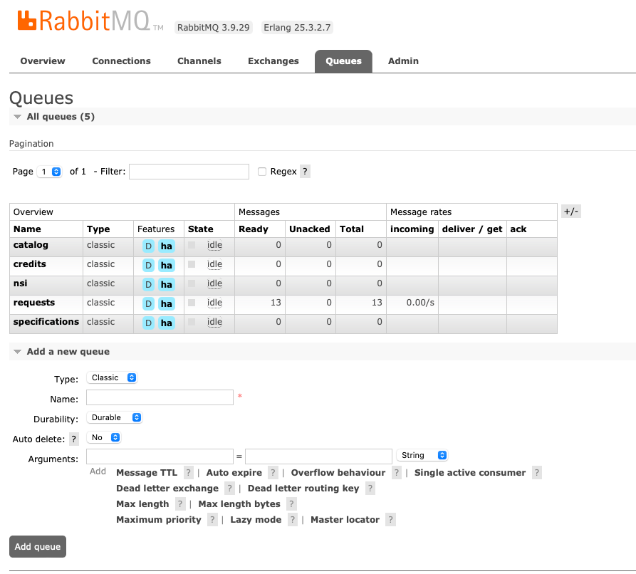

# YouTrack
## Создавать и настраивать доски
https://comptest.youtrack.cloud/agiles/154-2/current
## Создавать отчеты
https://youtrack.tages.ru/reports
## Настраивать интеграцию YT - gitlab
https://comptest.youtrack.cloud/admin/vcs

# Git
## Уметь работать с историей git'a // TODO показать локально
## Схлопывать в один все коммиты в ветке
    - git merge --squash 
        - при мердже своей ветки в другую и указании флага скуаша, 
          все коммиты из твоей ветки собираются в самый свежи коммит и мерджится, как один коммит
    - git rebase -i HEAD~5 
        - открывает редактор, где есть последние 5 коммитов из ветки. Перед каждым коммитом уже будет стоять выржение pick.
          Это мы даём команду оставить этот коммит. Следом можно выбрать несколько коммитов и pick заменить на squash.
    - git commit --amend
        - При коммите с таким флагом, мы даём команду гиту найти последний коммит, использовать его сообщение и изменить 
          этот коммит локальными изменениями
## git cherry-pick
    * Он позволяет скопировать изменения из одного коммита в свою ветку. В отдельных случая он очень даже полозен, 
      но им нельзя перебарщивать, потому что дублирование коммита, может привести к конфликтам и смотрится в истории 
      гита не очень красиво
    * Синатксис 
        git cherry-pick <commit-hash>
## git submodule 
    - В целом это репозитории внутри репозитория, поэтому все команды гита будут работать и в сабмодуле
    - Добавление сабмодуля
        - git submodule add {ссылка на репозитории} - добавляет всю репу со всеми ветками
        - git submodule add -b {название ветки} {ссылка на репозитории} - добавляет версию репы с указанной ветки
    - Обновление локального сабмодуля удалённым сабмодулем
        - Надо перейти в папу сабмодуля и использовать git pull
    - Пуш локальных изменении сабмодуля
        - Надо перейти в папку сабмодуля и использовать git commit и git push
[.gitmodules](.gitmodules)

## git bare для полной копии
    - Обычно его удобно использовать на сервере, чтобы не хранить все файлы, что может сократить память
    - Синтаксис
        - git clone --bare {ссылка на репозитории} - это создаст {название репы}.git папку с необходимыми данными, например, конфиг, 
          голову основной ветки и т.д.
# Инфраструктура // TODO показать в lens
## Знать k8s на уровне Namespace/Deployment/Service/Pod
### Namespace
    Это область работы среды окружения
### Deployment
    - помогает:
        - разворачивать окружение
        - откатывать окружение при возникновении ошибки
        - обновление системы по выбранной стратегии
    - можно указать:
        - кол-во реплик
        - стратегию (Recreate, RollingUpdate)
### Service
    - даёт доступ к подам извне
    - занимается балансировкой между подами
### Pod
    - похож на контейнеры в докере, но в поде можно держать несколько контейнеров(в жизни не встречала такого)

## Уметь работать на уровне SELECT/INSERT/UPDATE/DELETE в SQL базах данных
[product.go](internal%2Frepository%2Fproduct.go)

## Уметь работать в RabbitMQ/Kafka на уровне чтения и отправки вручную сообщений
    - В интерфейсе реббита, есть вкладка очередей, где отображаются все очереди

    - Нажав на необъодимую очередь, мы увидим все действия, которые можно выполнить с этой очередью

    - Для отправки сообщения в очередь надо открыть Publish Message

        - Headers - здесь указывают параметры сообщения по усмотрению
        - Properties:
            * content_type
            * content_encoding
            * priority
            * correlation_id
            * reply_to
            * expiration
            * message_id
            * timestamp
            * type
            * user_id
            * app_id
            * cluster_id
        - Payload - прописывается само сообщение 
    - Нажав на Publish мы опубликуем сообщение в очередь

# FulltextSearch
    Полнотекстовый поиск - с помощью него можно находить фрагменты текста и документы на «органическом» языке, 
    а также сортировать их по релевантности
    * Принцип работы состоит в том, что на основе текстовых данных строится индекс, 
      который способен очень быстро искать соответствия по ключевым словам
    * Обычно поисковые сервисы состят из двух компонентов: поисковик и индексатор
        - индексатор - получает текст на вход, делает обработку текста (вырезание окончаний, незначимых слов и т.п.) 
          и сохраняет все в индексе. Устройство такого индекса позволяет проводить по нему очень быстрый поиск.
        - поисковик - принимает от клиента запрос, обрабатывает фразу и ищет ее в индексе
    * Индекс для полнотекстового поиска строится примерно так

    * В postgres нет уже встроенного индекса, как в MySQL(FULLTEXT INDEX). В postgres надо использовать специальные функции с индексом GIN
[index_gin_fulltext_Search.sql](index_gin_fulltext_Search.sql)

# Индексы в postgreSQL
## B-tree
    - Это тип индекса по умолчанию в Postgres
    - Поиск быстрый, но остальные действия замедляются, поэтому много индексов тоже плохо

## хэш
    - Это те же самые хэш таблицы, где искомое значение хранится как хешированный ключ и рядом его полное значение
    - Идеальный пример это map в Golang
    - Коллизия - это вероятность наслоение записи на уже занятую область памяти
    - Логика работы:
        - Перед тем, как записать в хеш-таблицу, ключ проходит через хеш-функцию
        - Хеш-функция вычисляет хеш
        - Ищет в таблице по этому хеш есть запись или нет. Если нет, то записывает. Если есть, то возникает коллизия
          Чтобы решить эту коллизию есть два метода: метод открытой адресации и метод цепочек
            - метод открытой адресации
                - при коллизии этот метод ищет следующую пустую ячейку в таблице и записывает туда
            - метод цепочек
                - при коллизии этот метод сохраняет конфликтующие данные в отдельную табличку и у каждой записи будет ссылка на 
                  сл. конфликтующее значение
                
## GIN
    - Хорошая аналогия - алфавитный указатель в конце книги, где для каждого термина приведен список страниц, где этот термин упоминается
    - Используется для полнотекстового поиска
    - Значения индекса хранятся в виде B-Tree. В элементе индекса хранится не ссылка, а набор ссылок(номер страницы и позиция в странице)

# Логирование в pgx
[rest.go](internal%2Fhandler%2Frest.go) - 58 строчка

# goroutine
    Goroutine это поток, запускаемый в потоке рантайма
    Особенности:
    - Легковесный - запускаются в потоке самой программы, а не в ОС
    - Отсутствие лимитов на кол-во горутин
    - Конкурентность
[goroutine.go](internal%2Fusecase%2Fgoroutine.go)

## Общение между goroutine-ами
    - Каналы - буферизованные и не буферизованные
        * Не буферизованные
            - Синтаксис 
                chn := make(int chan)
            - Если в канале уже есть запись, то записывающие горутины переходят в ожидание, пока читающие не прочитают из канала
        * Буферизованные
            - Синтаксис 
                chn := make(int chan, 5)
            - Если в канале уже есть 5 записей, то записывающие горутины переходят в ожидание, пока читающие не прочитают из канала
            - Иначе, пока кол-во записей в канале < 5, записывающие горутины могут без блокировки записывать
        * В процессе работы с каналами, может случится, что канал закрылся, а одна горутина всё ещё не закончила записывать.
            В таком случае го запаникует. Чтобы избежать паники, перед записью в канал надо проверять она закрыта или нет:
                chanValue, ok := <- chn
            Если ok = true, то канал ещё открыт и можно записывать, иначе завершаем горутину
## Способы синхронизации горутин
    - wait group из пакета sync - нужен для завершения всех горутин до завершения основного
        * Из названия можно понять, что он нужен для синхронизации горутин, а именно группы горутин. 
          При использовании wait group, мы выставляем счётчик равны кол-ву всех горутин, и при завершении любого из них, 
          надо уменьшить счётчик. Таким образом мы даём шанс всем горутинам завершиться
    - mutex (Mutex, RWMutex)
        * Этот пакет позваляет блокировать область памяти(переменную), чтобы остальные горутины не вмешивались 
          и не испортили целостность данных
            - Mutex - он блокирует полностью - и для чтения и для записи
            - RWMutex - он блокирует только для записи, а читать из него можно будет
[goroutine.go](internal%2Fusecase%2Fgoroutine.go)

# Работать с композицией типов
    type HttpClient interface {
        Post()
        Get()
    }

    type Create struct {
        client HttpClient
    }

    func (c *Create) Post() { // some code }
    

    type Get struct {
        client HttpClient
    }

    func (g *Get) Get() {}

# ElasticSearch
    - Это инструмент для работы с полнотекстовым поиском
    - Позволяет выполнять выборки очень сложной формы, что делает его хорошим вариантом для аналитики
## заполнять индекс elasticsearch на базе данных из Postgres
    Можно провести условную аналогию: индекс — это база данных, тип — таблица в этой БД, документ - запись в таблице
[elastic.go](internal%2Felastic%2Felastic.go)
## Писать сложные запросы с настройкой релевантности
    - поле _score(по умолчанию сортируются по этому полю)
    - релевантность считается по алгоритму BM25 на основе следующего:
        - Как часто термин появляется в документе — временная частота ( tf )
        - Насколько распространен термин для всех документов — частота обратного документа ( idf )
        - Документы, содержащие все или большинство условий запроса, оцениваются выше, чем документы, который содержат меньше условий
        - Нормализация основана на длине документа, более короткие документы оцениваются лучше, чем более длинные
    - чтобы повысить релевантность можно строить запросы следующим образом:
    {
        "query": {
            "function_score": {
                "query": {
                    "match": {
                        "product_name" : "куртка"
                    }
                },
                "field_value_factor": { -- помогает поднять на вверх продукты с лучшим рейтингом
                    "field": "rate"
                }
            }
        }
    }

# HTTP
## Автодокументация Swagger
[swagger.json](docs%2Fswagger.json)

## github.com/gorilla/mux
[rest.go](internal%2Fhandler%2Frest.go)

# gRPC
## Реализовывать Stream на базе gRPC
[stream.proto](qualification_proto%2Fproto%2Fstream.proto)

# Тестирование
## Пистать Unit тесты
    они же модульные. Это тесты изолированные внутри пакета/модуля, которые тестируют отдельные методы классов и помогают при разработке.
[product_test.go](internal%2Fusecase%2Fproduct_test.go)

## Проводить функциональное тестирование
    Функциональные — тесты, обращающиеся к пакету/модулю как к чёрному ящику, вызывая только публичные методы.
[rest_test.go](internal%2Fhandler%2Frest_test.go)

# RabbitMQ - // TODO показать локально
## exchange
    - это прослойка между клиентом и очередью
    - занимается роутингом сообщении между очередями
    - при создании exchange-а можно указать тип, по которому он будет отсылать сообщения

## routing key
    - это ключь по которму определяется в какую очередь положить сообщение
## exchange > queue relations:
### fanout
    - exchange просто пуляет сообщение во все очереди
### direct
    - по routin key он смотрит в какую очередь гнать сообщение
### headers
    - по хедеру определяет в какую очередь гнать
### topic
    - по шаблону routing_key определяет в какую очередь гнать
## Publisher Confirms
    После паблиша сообщения, паблишер вешает слушатель на канал и ждёт там подтверждения от сервера, что сообщение получили
## RPC pattern
    - Это когда клиент отправляет запрос в очередь и указывает параметр reply_to, где может указать куда ссылать ответ от этого запроса
      Таким образом для отправки ответа не требуется доп. очередь
## DeadLetter
    - Это exchange, куда попадают сообщения если:
        - консюмер признал сообщение негативным(или некорректным) - nack и requeue = false
        - жизнь сообщения закончилось 
        - кол-во элементов в очереди максимальное
    - Консюмер отправляет обратно сообщение с тем же роутинг ки, с которым получил или присваивает новый в headers указав x-dead-letter-routing-key 
# Redis
## Применять inMemory Key/Value
    - основные методы это set <key> <value> и get <key> или keys <pattern>
    - в редисе также можно хранить хешированные данные:
            - hset <key> <field> <value> 
            - hget <key> <field>
            - hgetall <key>

# Логирование
## Работать с логированием в БД/Kafka и т.д. - почитать теорию и расписать его
## Сквозное прокидывание request_id по каждому запросу - jaeger

# Devops
## Envoy(настройка ratelimit и авторизацию через микросервис)
    * Это прокси сервер, который который занимается балансировкой, маршрутизацией и т.д.
    * Отличия от nginx, которые я нашла:
        - файл конфигурации структурированнее, чем в nginx
        - очень много настроек идут под копотом, когда как в nginx надо отдельные пакеты затягивать
    * настройка rate limit-а даёт возможность ограничить кол-во входящих запросов и может выступать как прохи. 
      В envoy они предоставляются как фильтры
      Есть два вида rate limit-а: локальный и глобавльный
        - при локальной настройке для каждого кластера так и для отдельных роутов устанавливаются свои настройки фильтра и 
          используется token_bucket. Если токен ещё актуальный, то запрос оработается. Иначе подключение сразу же закроется 
            type_url: type.googleapis.com/envoy.extensions.filters.http.local_ratelimit.v3.LocalRateLimit
            value:
              stat_prefix: http_local_rate_limiter
              token_bucket:
                max_tokens: 50
                tokens_per_fill: 10
                fill_interval: 120s
              response_headers_to_add:
                - append_action: APPEND_IF_EXISTS_OR_ADD
                  header:
                    key: x-rate-limited
                    value: TOO_MANY_REQUESTS
              status:
                code: BadRequest
        - для глобавльной найстройки rate limit-а надо поднять отдельный сервис, в котором будут указаны настройки вида:
            domain: productpage-ratelimit
            descriptors:
              - key: PATH
                value: "/productpage"
                rate_limit:
                  unit: minute
                  requests_per_unit: 1

# Разделять запуск приложение с помощью команд и Обрабатывать флаги запуска
[goroutine.go](cmd%2Fgoroutine.go)

# Sentry
[rest.go](internal%2Fhandler%2Frest.go)
